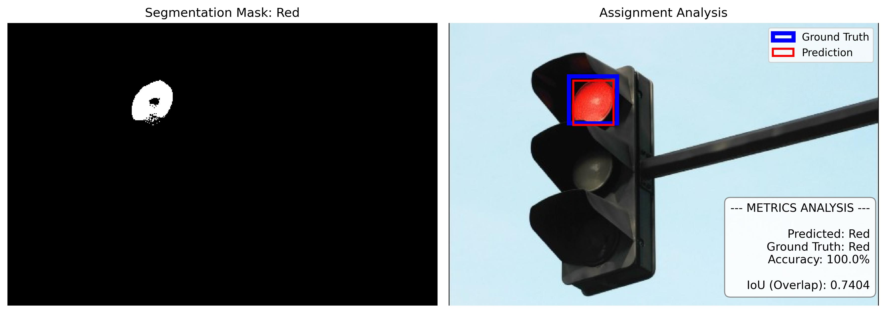
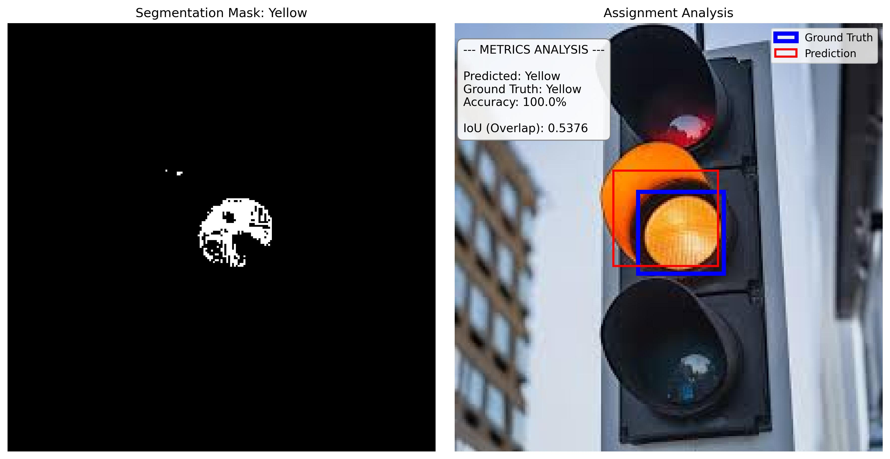
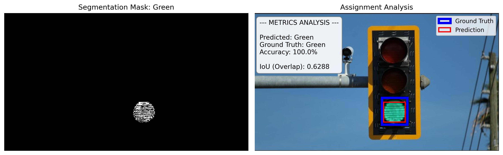

# CVL_Assignment02: Traffic Light Detection & Evaluation

## Methodology

I implemented a complete object detection pipeline from scratch (without utilizing external computer vision libraries like OpenCV for the core logic) to identify, localize, and classify traffic light states. The approach relies on **Pixel-based Segmentation (Color Thresholding)** followed by a rigorous metric evaluation.

### 1. Color Segmentation (Thresholding)
To detect the active light, I separated the image into its Red, Green, and Blue (RGB) channels and applied strict pixel-intensity thresholds. This isolates specific colors by checking if a pixel's RGB values fall within a predefined range. 

For example, to find the **Red** light, the algorithm applies the following logical mask:

$$Mask_{red} = (R > 150) \land (G < 100) \land (B < 100)$$

The algorithm counts the total number of pixels that pass the threshold for Red, Yellow, and Green, and classifies the image based on which color has the highest pixel count.

### 2. Localization (Bounding Box Extraction)
Once the colored pixels are segmented into a binary mask, the algorithm performs localization. It scans the mask to find the outermost pixel coordinates (minimum and maximum $X$ and $Y$ values). These coordinates form the **Predicted Bounding Box** that tightly wraps the detected light.

### 3. Metric Evaluation (Accuracy & IoU)
To prove the algorithm's effectiveness, it is evaluated on two distinct metrics against a human-verified **Ground Truth** (Answer Key). To avoid circular logic, I built a custom interactive annotation tool using Matplotlib to manually draw and extract the exact ground truth coordinates before running the evaluation.

* **Classification Accuracy:** Measures if the predicted color matches the ground truth color (0% or 100%).
* **Intersection over Union (IoU):** Measures the localization accuracy by calculating how perfectly the Predicted Box (Red) overlaps with the Ground Truth Box (Blue). The formula is:

$$IoU = \frac{\text{Area of Overlap}}{\text{Area of Union}}$$

## Results

Below are the analysis results for the three traffic light conditions. The output images display the generated pixel segmentation mask on the left, and the bounding box evaluation (Prediction vs. Ground Truth) alongside the final metrics on the right.

### Part 1: Red Light Detection

### Part 2: Yellow Light Detection

### Part 3: Green Light Detection

---

## Analysis of Metrics

**1. Classification Accuracy (100%)**
The color segmentation algorithm achieved a perfect 100% accuracy in classifying the traffic light states. The RGB thresholding masks successfully isolated the dominant active color in each image without triggering any false positives.

**2. Localization Accuracy (IoU > 0.50)**
In object detection, an IoU score above 0.50 is universally considered a successful, valid detection. The algorithm successfully localized all three lights:
* **Red Light (IoU: 0.7404):** The highest localization score. The illuminated red pixels were tightly clustered, allowing the predicted bounding box to closely match the physical bulb.
* **Green Light (IoU: 0.6288):** A strong detection. The predicted box captured the LED grid perfectly, with only minor deviations from the ground truth shape.
* **Yellow Light (IoU: 0.5376):** A successful detection, but the lowest score. This is caused by environmental "light bleed." The yellow bulb is so intensely illuminated that the light reflects off the traffic light's plastic housing. The algorithm correctly detected these illuminated glare pixels, which naturally caused the predicted bounding box to expand slightly beyond the physical boundaries of the bulb itself.
